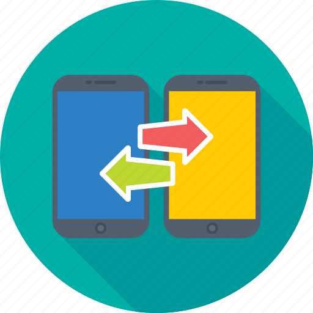

# Phone-T Smart Phone Trade App #

### Overview ###

A smartphone  trade web app is an online platform designed to facilitate the buying, selling, and trading of smartphones. Users can list their used devices, browse available options, and conduct exchanges directly through the app. The web application typically offers features such as device condition assessments and provides a convenient and eco-friendly solution for consumers looking to upgrade their devices while minimizing waste.

### Installation ###
To run the application locally, follow these steps:

1) Install dependencies using **npm install**
2) Start the server by running **nodemon app**

### Features ###
1) User Registration and Authentication 
2) List Items :  Add the smart phone item you wish to trade 
3) Manage Items : Perform CRUD operations on the items - Add/Edit/View/Delete
4) Manage Offers : Offer your smart phone to swap / Accept or Reject offers made by others
5) Watch List    : Add items to the watchlist
6) Profile       : Have a profile to check the user activities such as trade items created, offers made, offers received, watchlist.

### Tech Stack ###
Its a MEN stack  application  - MongoDB, Express, Node.js, JavaScript, HTML, CSS. 

